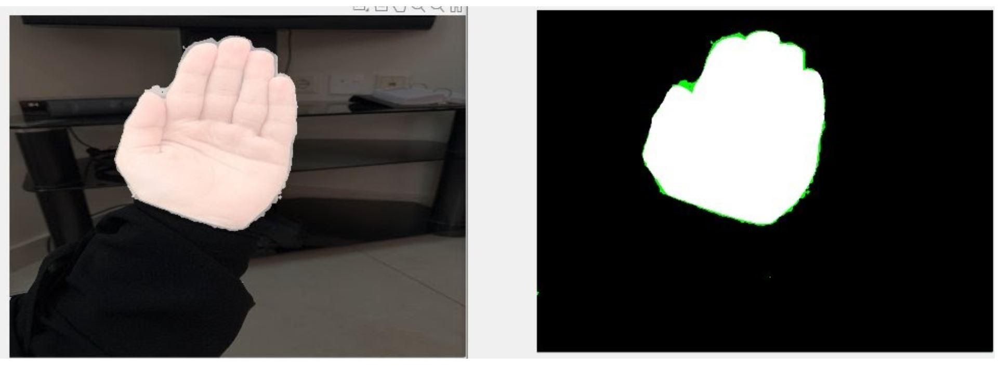

# Hand-Segmentation
Hand Segmentation Using Deep Learning For Arabic Sign Language

<br />**Problem statement** <br />
Hand segmentation is a challenging task despite advances in hand detection and hand tracking.
Problems for hand segmentation can be caused by a variety of factors, such as complicated background removal, skin color detection, etc.
 


<br />**Proposed solution**<br />
Deep Learning is a kind of machine learning and training to build a model of a large amount of data.
<br />This type of algorithm is built to learn the features without having to define those features in advance. Besides, it is one of the best algorithms that enable the machine to learn different levels of data features (for example images). 
Deep learning has excelled in creating new characteristics that can be learned at different levels, and this may lead researchers in the future to focus on this vital aspect. The features are the first factor 
in the success of any 
intelligent machine learning algorithm. The ability to extract and / or select features correctly, and represent and configure data for 
learning is the point between success and failure of the algorithm. Deep learning can be used in making predictions with pre-trained 
models to recognize/classify an object in an image, which helps the image segmentation process, as the segmentation is a specific image 
processing technique used to split an image into two or more significant parts.
In our work, we implemented a system to accurately segment ArSL images into two class labels: hand and background. By training a deep 
learning model using 60% of a huge dataset of ArSL gestures while split the rest of the dataset equally in 20% for validation and 20% 
for testing. And then use the mask images to assess the model performance.
The system uses ResNet-18 architecture, which is a pre-trained convolutional neural network.<br />


The system takes as input two file one contains the unlabeled images, and the other contains the ground truth. The model will learn the 
relation between the two and consequently will be able to segment new hand images. 
This is be achieved by the following steps: 

<br />**Training**<br />
 <br />1- Loading the input and labels files.<br />
2- Create two classes for the classification step, namely, Background and Hand.<br />
3- Split the data into 60% training, 20% validation, and 20% testing. <br />
4- Load the ResNet-18 model. <br />
5- Assign weight for every class based on the class frequency. <br />
6- Set the training options as follows: <br />
Learning rate: 0.3 <br />
Learning period drop: 10<br />
Meaning, the learning rate reduced by a factor of 0.3 every 10 epochs. This allows the network to learn quickly with a higher initial learning rate while being able to find a solution close to the local optimum once the learning rate drops.<br />
Momentum: 0.9<br />
L2Reqularization: 0.005 <br />
Max Epochs: 30<br />
Mini Batch Size: 8 <br />
Shuffle: every epoch<br />
Validation Patience: 4<br />
This will stop training early when the validation accuracy converges. Thus, it prevents the network from overfitting on the training dataset.<br />
7- Train the model with the training and validation datasets.<br />
8- Save the trained network. <br />

**Testing**<br />
    1- Load the pretrained model. <br />
    2- Choose one image from the test set and pass it to the pretrained model. <br />
    3- Compare the predicted output with the expected output. The white spaces indicates correct segmentation. Whereas the green highlights is the mismatch spaces.<br />
**Evaluation** <br />
    The model can be evaluated using the predefined ```evaluateSemanticSegmentation```
function that will show the model accuracy, IoU and MeanBFScore for each class. 
In our training the accuracy is rising as the training goes further while the loss is dropping down.
Overall our validation accuracy was # 96.08%.


<br /> The image placed on the left is the input image and the image placed on the right is the output image. The white area that appears on the output images is the area that is matched successfully from the input image and the mask. <br />
